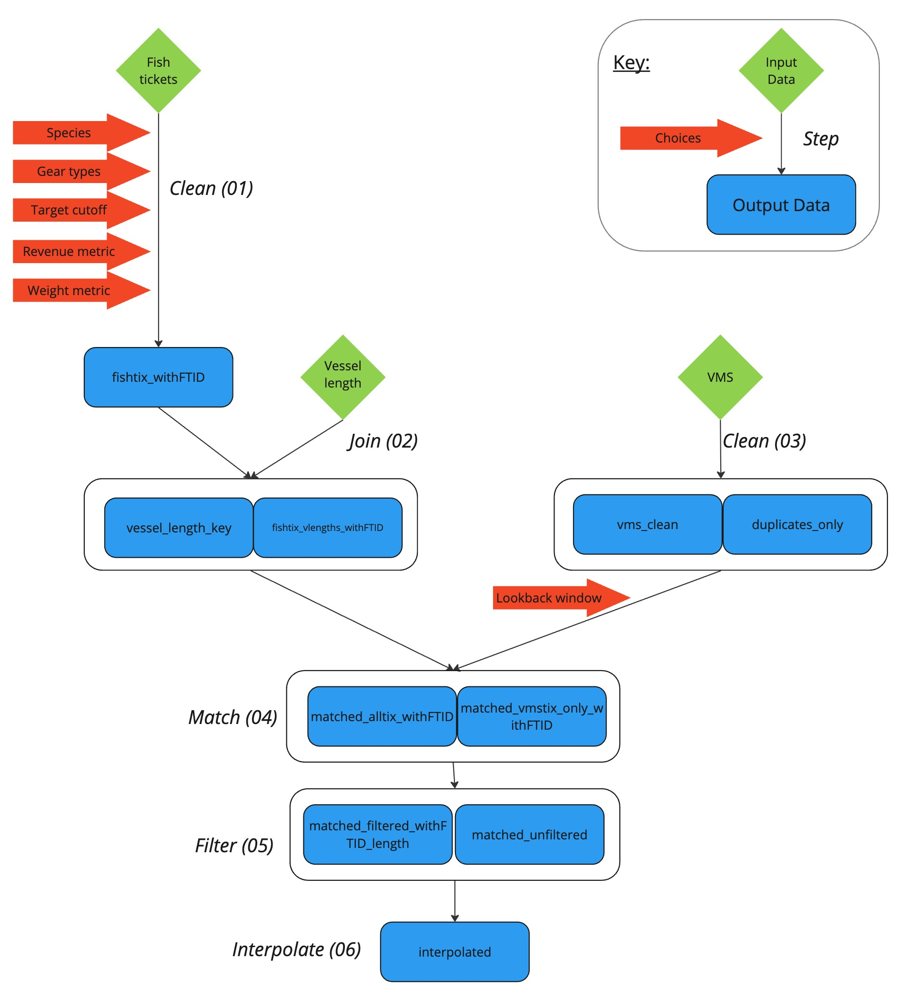

# VMS Pipeline Introduction

## Purpose
This repository collates the code used to process Vessel Monitoring System (VMS) data and join it to PacFIN fishery landings (i.e., "fish ticket") data for the U.S. West Coast to produce spatial information on fishing activity. These outputs are useful for a wide array of applications in west coast fishery management, such as describing spatial fishing behavior and dynamics, assessing fisheries overlap with protected resources, and attributing drivers of change in west coast fisheries.

## Structure
The repository is structured into multiple required steps in the processing of VMS and fish ticket  data from raw inputs into useful outputs. This process has a number of steps, including multiple QA/QC steps. These steps are described in detail in the associated `.Rmd` files in the `code/pipeline_steps` folder. You will run the `main_process.Rmd` file, which will call each individual data processing step in its own script, which will create a `processed_data` folder with your output, and a knit document. You can then run `move_markdown_html.R` to move the knit document to be with the rest of the output. This organization provides separate modules of the individual steps, which makes it easier to develop and debug, while maintaining the overall framework in one document.

Most raw data in this project are large and confidential. This repository therefore does not include any raw data, but refers to these data using the relational command from the `here` package `here::here()`. Authorized data users that wish to run or utilize specific pieces of the workflow should obtain the relevant data from one of the moderators of this repository and place it in the `raw_data` folder. Then, all of the code herein should run without needing to change any file path references.

## Pre-requisites

If it’s your first time running the pipeline (ever or after a break), you will need to:

1. Pull from main branch on GitHub
2. Adjust files and directory structure that are not tracked on GitHub

The directory structure you have will mostly be set up from pulling these changes, but there are some exceptions that are not tracked on GitHub (they are in `.gitignore`) that you will have to set up yourself. Those files are:

* `spatial_data/bathymetry/composite_bath.tif` This file is quite large and is therefore not tracked on GitHub. Visit the link in `spatial_data/bathymetry/README_bathymetry-file-link.txt` to download it.
* `Confidential/raw_data` This directory contains confidential information and is therefore not tracked on GitHub. Here are the files and file structure you will need to run the pipeline:
  * `raw_data/fish_tickets/all_fishtickets_1994_2023.rds`
  * `raw_data/vessel_registration/2009_2023_vesselreg.csv`
  * `raw_data/vms/`
    * `vms chunk 1 2009 2010.rds`
    * `vms chunk 2 2010 2011 2012.rds`
    * `vms chunk 3 2012 2013.rds`
    * `vms chunk 4 2013 2014 2015.rds`
    * `vms chunk 5 2015 2016.rds`
    * `vms chunk 6 2016 2017 2018.rds`
    * `vms chunk 7 2018 2019.rds`
    * `vms chunk 8 2019 2020.rds`
    * `vms chunk 9 2020 2021 2022.rds`
    * `vms chunk 10 2022 2023.rds`
    * `vms chunk 11 2023.rds`

## Pipeline Flow

This VMS-fish ticket data processing pipeline is organized in six steps required to clean, match, and interpolate the data for each year. Each step is briefly described here, with the details and step-by-step code available for each year in the `pipeline_steps` folder.

1. **Clean and organize PacFIN fish tickets**. This step takes the raw PacFIN fish tickets, checks for errors, extracts and renames the variables of interest (such as gear type and catches of various species), and, most importantly, defines target species for each ticket based on both landed pounds and revenue.

2. **Assign vessel lengths to the fish tickets**, based on a separate database of vessel registrations and a set of decision rules to address vessels with multiple conflicting records, missing records, etc.

3. **Clean and organize raw VMS data**. We add unique identification numbers for each VMS record, remove records that are outside our spatial domain (west coast US EEZ), and attach depth via a spatial bathymetry layer.

4. **Match the cleaned VMS and fish ticket data**. This is one of the more involved steps because it involves making important decisions on how to join VMS data to fish ticket data. At its base, the match is done through the unique vessel identification numbers that are common to both data sources. Then, we assign VMS records to individual fish tickets by their timestamps: the VMS records associated with a fish ticket are those that fall between each ticket and the previous ticket associated with that vessel, or within the lookback window; whichever window of time is shorter. The result of this step is one matched dataset, including the information from both the fish tickets and the VMS data.

5. **Filter the matched data**. We impose a few filters to remove seemingly erroneous records. The filters include removing trips that do not seem to return to the correct landing port; removing VMS segments whose calculated speed is unrealistically high; removing VMS points that are seemingly on land (have a positive depth value); and removing VMS points that are between fishing trips, i.e. VMS pings from a vessel sitting in port idle between trips.

6. **Create an interpolated, regularized version of the matched data**. For some applications, analytical methods require spatial records to be evenly distributed across time. We perform linear interpolation of each fishing trip, placing some new VMS points along vessel trajectories such that there is one record exactly every hour.

After the pipeline has run and the markdown document is ready, run `move_markdown_html.R` to rename and move the knit document into the Confidential output folder.

Here is a flowchart of the VMS pipeline, indicating each step in the pipeline with its corresponding parameters and outputs:

## Pipeline Options

Each individual process step (i.e., Steps 01-06 in the `pipeline_steps` folder) contains descriptive details on the analytical choices in various steps of the pipeline. However, overall, the pipeline is designed to be general, and the number of choices to be made by the analyst are few. The key initial choices on data processing are contained in the beginning of the `main_process` file:

| Choice  | Parameter | Description |
| ---- | :-----: | ------- |
| Species  | `spp_codes`    | For which species ([PacFIN species codes](https://pacfin.psmfc.org/pacfin_pub/data_rpts_pub/code_lists/sp.txt)) do you want specific landings information (weight and value) NOTE: this does NOT filter which fish tickets are processed, but rather adds extra variables |
| Gear types | `gear_codes`  | similar to above, should be thought of NOT as a filter on which gears ([PacFIN gear codes](https://pacfin.psmfc.org/pacfin_pub/data_rpts_pub/code_lists/agency_gears.txt)) you get out of the pipeline, but rather as all of the gear types for which you would like total revenue and landings (e.g. "CRAB POT"), regardless of target species. |
| Target cutoff    | `target_cutoff` | Determines how the target species of each trip is calculated. For trips that land multiple species, how much "more important" does your target need to be than the species with the second greatest catch? Expressed as a ratio. |
| Revenue metric | `pacfin_revenue_metric` | Which PacFIN-reported revenue metric to use in calculation of landings |
| Weight metric | `pacfin_weight_metric` | Which PacFIN-reported weight metric to use in calculation of landings |
| Lookback window | `lookback_window` | What is the maximum allowed trip length to attach to a fish ticket (e.g., maximum allowed difference between first and last VMS pings associated with a trip). |

**Parameter details**

* *Species code* refers to the `NOMINAL_TO_ACTUAL_PACFIN_SPECIES_CODE` attribute or column in the fish ticket data, which does not subdivide groundfish species into additional species codes. For example, dover sole are only listed as `DOVR`, not `DOVR` and `DVR1` as found in the `PACFIN_SPECIES_CODE` attribute.
* *Target cutoff* uses a ratio to determine the target for a given fishing trip, using revenue for the derived column `TARGET_rev` and using weight for the derived column `TARGET_lbs`. For a species to be considered the target, the ratio between the highest and 2nd highest catch must be greater than or equal to the target threshold. For example, if the threshold is set to `1.1`, then a species is considered a target if its catch ≥10% more the catch of the next highest catch on that fishing trip.
* *Lookback window* provides a maximum length for a fishing trip, and is set based on the fishery. If the lookback window is too short, the pipeline will miss fishing activity. If the lookback window is too long, the pipeline derived fishing trip will include VMS pings from when vessels transited into a given fishery, which aren't considered active fishing.

## Pipeline Outputs

The main output of this data analysis pipeline is clean fishery landings data (fish tickets), joined to the relevant spatial information (VMS ping locations) associated with each fishing trip. As the pipeline runs, it produces intermediate outputs, which are especially helpful for checking errors and quality assurance/control (QA/QC). Example file names are listed below, where `yyyy` refers to the year of data the pipeline was run for.

| Output file name suffix | Description | VMS Pipeline Step | 
| -------- | ------- | :---: |
| `fish_tickets/fishtix_withFTID_yyyy.rds` | Cleaned fish tickets with associated target species | 1 |
| `vessel_length_ _keys/vessel_length_key_yyyy.rds` | Derived join key between vessel registration data and PacFIN vessel identifiers to get vessel length | 2 |
| `fish_tickets/fishtix_vlengths_withFTID_yyyy.rds` | Cleaned fish tickets joined with vessel lengths | 2 |
| `vms/vms_clean_yyyy.rds` | Cleaned VMS data that is cropped to US EEZ, includes bathymetry, excludes records on land, and de-duplicate VMS records | 3 |
| `vms/duplicates_only_yyyy.rds` | Same as `vms_clean`, but includes only duplicate records (generated for QA/QC) | 3 |
| `matched/matched_vmstix_only_withFTID_yyyy.rds` | Cleaned fish tickets joined to cleaned VMS data, excluding trips with not matched VMS data | 4 |
| `matched/matched_alltix_withFTID_yyyy.rds` | Same as `matched_vmstix_only_withFTID`, but including trips that are not matched with VMS data (generated for QA/QC) | 4 |
| `filtered/matched_filtered_withFTID_length_yyyy.rds` | Cleaned fish tickets joined to cleaned VMS data, with filters calculated and applied | 5 |
| `filtered/matched_unfiltered_yyyy.rds` | Same as `matched_filtered_withFTID_length`, but filters not applied (generated for QA/QC) | 5 |
| `interpolated/interpolated_yyyy.rds` | Cleaned and filtered fish ticket data joined to VMS data, with interpolation to regularize the VMS ping interval | 6 |

**Which output file should I use?**

* To create fishing activity heatmaps, use either `matched_filtered_withFTID_length` for non-interpolated data or `interpolated` for interpolated data.
* To calculate the proportion of boats, trips, landings and revenue that was tracked from vessels using VMS transponders, use `matched_alltix_withFTID`, which adds a row for each fish ticket that could not be matched to a VMS tracked fishing trip.

## Disclaimer

This repository is a scientific product and is not official communication of the National Oceanic and Atmospheric Administration, or the United States Department of Commerce. All NOAA GitHub project content is provided on an "as is" basis and the user assumes responsibility for its use. Any claims against the Department of Commerce or Department of Commerce bureaus stemming from the use of this GitHub project will be governed by all applicable Federal law. Any reference to specific commercial products, processes, or services by service mark, trademark, manufacturer, or otherwise, does not constitute or imply their endorsement, recommendation or favoring by the Department of Commerce. The Department of Commerce seal and logo, or the seal and logo of a DOC bureau, shall not be used in any manner to imply endorsement of any commercial product or activity by DOC or the United States Government.
